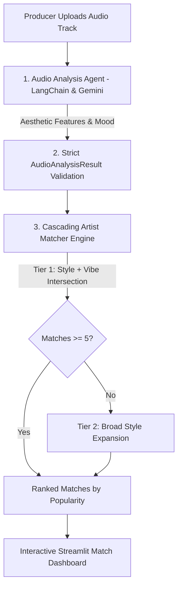

# 🎧 BeatMatch AI — Sonic Identity Matching MVP & Audio Intelligence

[](https://github.com/jraphaelbarbosa/beatmatch-ai-mvp)


> **[ 🇧🇷 Ler em Português ](README.pt-br.md)**

> **Executive Overview:** The **BeatMatch AI MVP** is an AI-powered sonic matching system for music producers and independent artists. Music producers upload raw beat tracks to extract aesthetic features (tempo, musical key, sub-genre, mood tags), which are automatically queried against a curated artist database using a **cascading matching engine** (strict Style/Vibe intersection falling back to broad style clustering).

---

## 🏗️ 1. Architecture & Matching Engine



---

## 🛡️ 2. Enterprise Reliability & Design Decisions

### ⚡ Cascading Search Fallback (Zero Dead-Ends)
* Strict dual-axis matching (Style AND Vibe) occasionally yields sparse result sets in niche sub-genres.
* The matching algorithm applies a deterministic two-tier fallback: if Tier 1 yields `< 5` candidates, Tier 2 automatically expands across the primary genre style while strictly excluding previously returned IDs, ensuring users always receive relevant artist recommendations.

### 📐 Strict Data Contracts (Pydantic v2)
* Upgraded models in `src/models/schemas.py` enforce strict bounds on tempo (`40 <= bpm <= 250`), confidence metrics, and popularity scoring.

### 🧪 Automated Unit Testing
* Fast unit test suite (`pytest`) validating audio analysis schemas and database cascading search logic using deterministic mocks. Execution completes in **< 0.2 seconds**.

---

## 🚀 3. Quickstart & Local Execution

### Setup & Run
```bash
# 1. Clone repository
git clone https://github.com/jraphaelbarbosa/beatmatch-ai-mvp.git
cd beatmatch-ai-mvp

# 2. Setup virtual environment
python -m venv venv
source venv/bin/activate  # Windows: venv\Scripts\activate

# 3. Install dependencies
pip install -r requirements.txt

# 4. Run tests
pytest tests/ -v --cov=src

# 5. Launch Streamlit Application
streamlit run src/app.py
```

---

## 📂 4. Canonical Repository Structure

```text
beatmatch-ai-mvp/
├── .github/
│   └── workflows/
│       └── ci.yml                     # Automated CI Quality Gate
├── src/
│   ├── models/
│   │   └── schemas.py                 # Pydantic v2 Strict Data Contracts
│   ├── app.py                         # Streamlit Executive Dashboard
│   ├── agent_audio.py                 # LangChain audio feature analysis
│   ├── find_matches.py                # Cascading artist matching engine
│   ├── normalize_genres.py            # Genre ontology normalizer
│   └── db_manager.py                  # Database connection pooling
├── scripts/
│   └── ops/                           # Connection testing & model listing tools
├── tests/
│   ├── conftest.py                    # Pytest Global Fixtures
│   └── unit/
│       ├── test_schemas.py            # Pydantic contract tests
│       └── test_matcher.py            # Cascading search logic tests
├── requirements.txt                   # Production dependencies
└── README.md                          # Technical platform documentation
```
